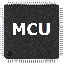
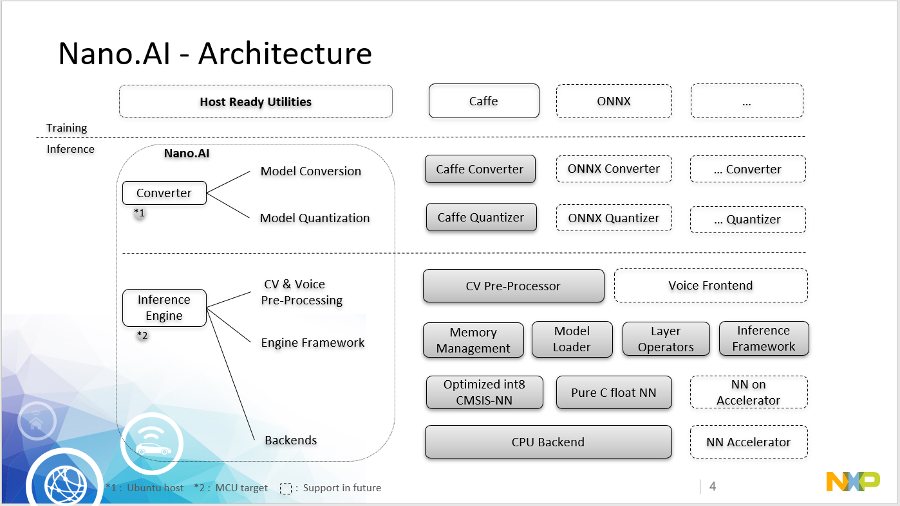
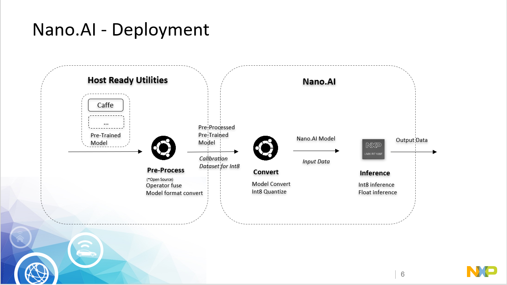

#  Nano.AI
**N**ano.AI is a lightweight neural network inference framework which is fully optimized for NXP 's MCU(arm m-core) platform. 

It is deeply considerate about the deployment of AI models on MCU platform which has limited memory and computing resource from design to implementation. 

## Features

- Pure c implementation without 3rd-party library dependency 

- Support float and int8 quantized inference

- Extremely memory reuse

- Fully optimized in performance and accuracy for MCU int8 quantized inference

- Easy deployment on MCU platform

---

## Architecture


**N**ano.AI can be divided into ***converter*** and ***Inference Engine*** parts.  

#### **Converter**

The convert part is responsible for parsing the pre-trained models and convert to Nano.AI defined model format for the following execution on the target. Currently it supports the Caffe format model. Other popular Model format like ONNX/Tensorflow/Pytorch/MXNET will be supported in future.  Currently customer can leverage the open source offline model convert tool to convert them into Caffe for deployment with Nano.AI.

   - The convert also includes the quantization tool to generate the int8 quantization information for the int8 quantized inference. Currently the quantization tool supports the Caffe format model. 

#### **Inference Engine**


- The inference engine will build the network graph with the Nano.AI defined model format, then invoke the inference engine to forward the graph with the input data, and extract the output data from the graph to the caller.
- The inference engine won’t allocate the memory directly, it exports the API to report the buffer requirement of the graph and request the caller to allocated the buffers, all the inference will purely based on the requested buffers.
- Currently the float inference and int8 quantized inference are supported. The float inference is not fully optimized and only for accuracy comparison purpose. The int8 quantized inference if fully optimized with the NXP MCU int8 accelerations.  Typically the float graph will take 4 times memory requirement compared with int8 graph.  Customer can select the float or int8 inference based on the balance between memory, performance and accuracy. 

****

## Deployment


**N**ano.AI typically includes ***Pre-Process***, ***Convert***, and ***Inference*** stages in the deployment: 

#### **Pre-Process Stage**    [[user guide](./doc/preprocess_user_guide.md)]

Pre-Process Stage can leverage the open source ready utilities to do the offline model optimization for better performance, for example:
     - BatchNorm and Scale Merge to Previous Convolution
     - Other operation fusion

#### **Convert stage**    [[user guide](./doc/tools_user_guide.md)]

Convert stage will use the model converter tool to generate the Nano.AI format models.
     - For the generation of the int8 quantized model, the quantization component will also be invoked to get the quantization information with the calibration data set.  The calibration data set will impact the accuracy of the int8 quantized inference. The training, validation and test data set of the model is highly recommended to use as the calibration data set .

#### **Inference stage**    [[engine API](./doc/engine_api.md)]

Inference stage will take the generated Nano.AI format model and the input data to do the graph inference, then extract the output data for the caller.
     - Popular network such as LENET, CIFAR10 will be provided as the SDK example of the deployment for customer reference.

****

## Nano.AI model definition

**N**ano.AI model is represented in ***c array format*** for compiling into the final application. It has below 3 components:

#### **Blob ID Definition**

Unique id for the blobs
  - Input/output/intermedia

```
enum {
    LENET_INT8_B_DATA_ID = 0,
    LENET_INT8_B_CONV1_ID = 1,
    ...
    LENET_INT8_B_PROB_ID = 8,
    LENET_INT8_B_COUNT
};
```
#### **Model**

The model graph information:

Layers
  - Layer information: type, parameters
  - Bottom blobs
  - Top blobs.

```
NANONN_MODEL static NANONN_CONST unsigned char BINARY_MODEL_ALIGN lenet_int8_binary_model[] = {
0x5a,0x44,0x00,0x01,0x09,0x00,0x09,0x00,0x02,0x00,0x01,0x00,0x09,0x00,0x02,0x00,
0x18,0x02,0x00,0x00,0x24,0x00,0x00,0x00,0x30,0x00,0x00,0x00,0xae,0x00,0x00,0x00,
...
0x03,0x9b,0x39,0x3d,0x06,0x00,0x01,0x00,0xf0,0x08,0x00,0x00,0x1e,0xbd,0x0c,0x3d,
0x07,0x00,0x0a,0x00,0xf4,0x08,0x00,0x00,0xa7,0xf0,0x28,0x3d,0x08,0x00,0x01,0x00,
};
```
#### **Model Data**

Layers which have the weights/bias
  - Weights/Bias information: size, format
  - Weights/Bias data
```
NANONN_MODEL_DATA static NANONN_CONST unsigned char BINARY_MODEL_ALIGN lenet_int8_binary_model_data[] = {
0x64,0x00,0x00,0x00,0x58,0x02,0x00,0x00,0x03,0x00,0x02,0x00,0xa8,0x61,0x00,0x00,
0x32,0x00,0x00,0x00,0xa8,0x02,0x00,0x00,0x50,0x64,0x00,0x00,0x05,0x00,0x02,0x00,
...
0xbf,0xa8,0x17,0x3d,0x41,0x16,0x30,0x3d,0xbd,0x2a,0x31,0x3d,0xc6,0x08,0x35,0x3d,
0x9e,0x63,0x35,0x3d,0x8c,0x1c,0x27,0x3d,0xe2,0xc7,0x20,0x3d,0x3c,0xbf,0x27,0x3d,
};
```

---

## Supported Operators

| Index | Operator             | Comments | Reference |
| ----- | -------------------- | -------- | --------- |
| 0     | Input                |          |           |
| 1     | Convolution          |          |           |
| 2     | DepthwiseConvolution |          |           |
| 3     | Pooling              |          |           |
| 4     | Relu                 |          |           |
| 5     | Prelu                |          |           |
| 6     | Innerproduct         |          |           |
| 7     | Split                |          |           |
| 8     | Scale                |          |           |
| 9     | Eltwise              |          |           |
| 10    | Softmax              |          |           |
| 11    | Dropout              |          |           |
| 12    | Concat               |          |           |
## Benchmark

| Model   | Model Size(Kbytes) | Input   Dimension(C x H x W) | Runtime Memory(Kbytes) | [Single Inference Time on NXP RT106F  Kit(ms)](https://www.nxp.com/design/designs/nxp-edgeready-mcu-based-solution-for-face-recognition:MCU-FACE-RECOGNITION) | MSE With Float | Similarity With Float | Calibration  Data set           |
| ------- | ------------------ | ---------------------------- | ---------------------- | ------------------------------------------------------------ | -------------- | --------------------- | ------------------------------- |
| mnist   | 426                | 1x28x28                      | 18                     | 9.5                                                          | 0.000063       | 1.0                   | mnist train and test data set   |
| cifar10 | 90                 | 3x32x32                      | 45                     | 38.5                                                         | 0.009022       | 0.999872              | cifar10 train and test data set |
|         |                    |                              |                        |                                                              |                |                       |                                 |


---

## Community
WeChat Group "Nano.AI"

---

## References

**N**ano.AI refers to the following famous open source projects:
- [Caffe](https://github.com/BVLC/caffe)
- [Protobuffer](https://github.com/protocolbuffers/protobuf)
- [NCNN](https://github.com/Tencent/ncnn)
- [ONNX](https://github.com/onnx/onnx)
- [MNN](https://github.com/alibaba/MNN)
- [CMSIS NN](https://arm-software.github.io/CMSIS_5/NN/html/index.html)
- [Open CV](https://opencv.org/)

---
Copyright 2016-2020 NXP